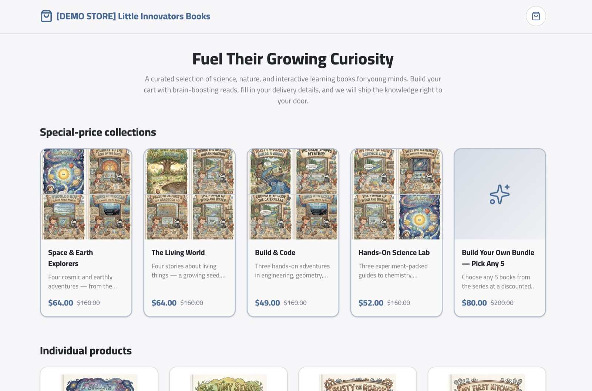
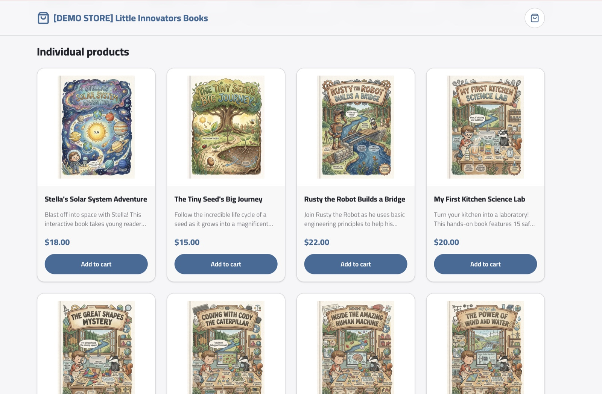
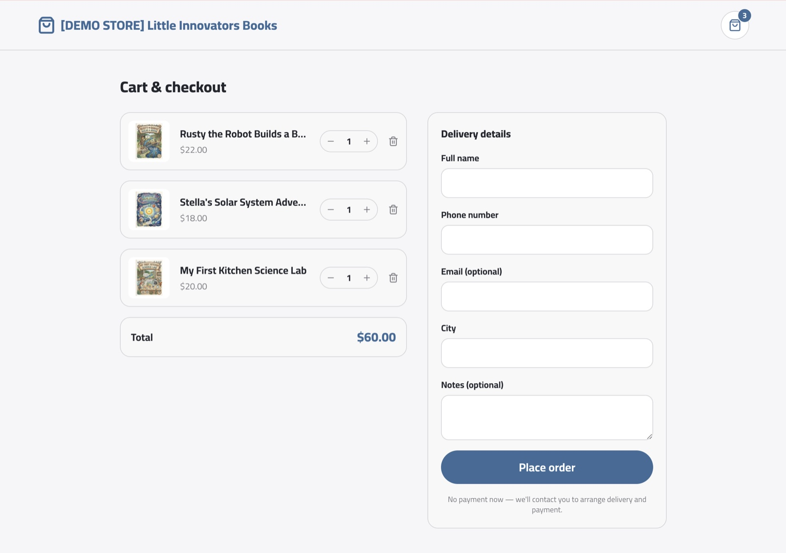
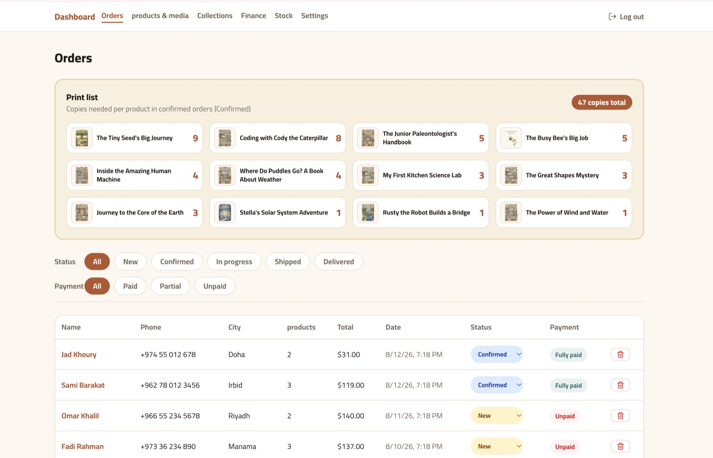
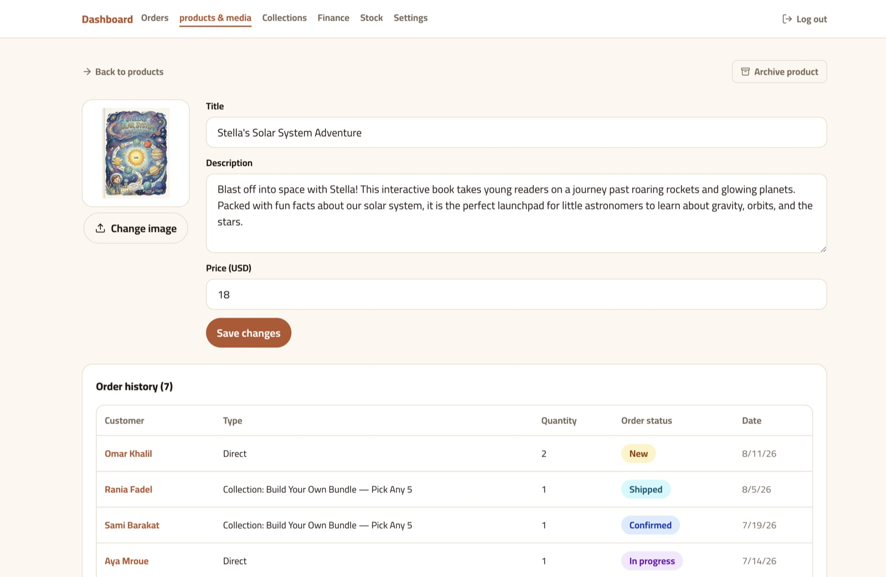
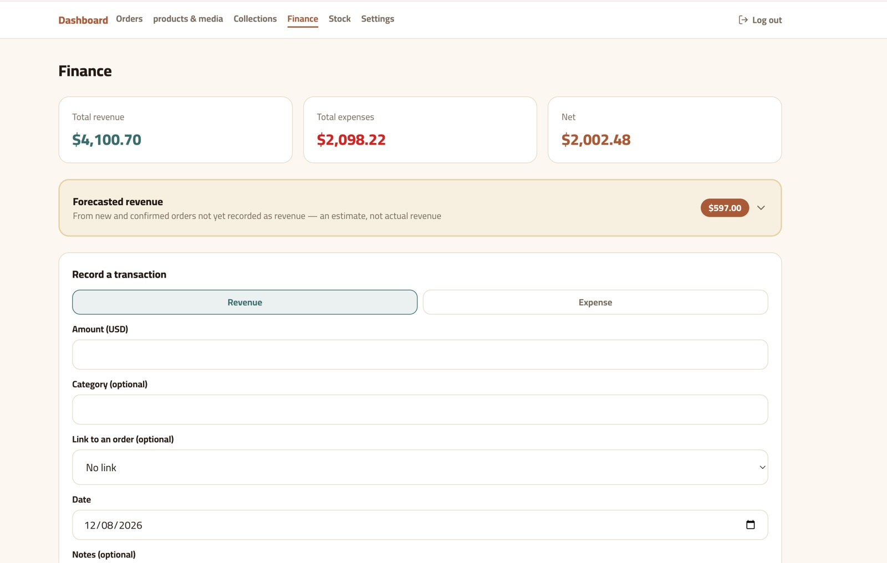
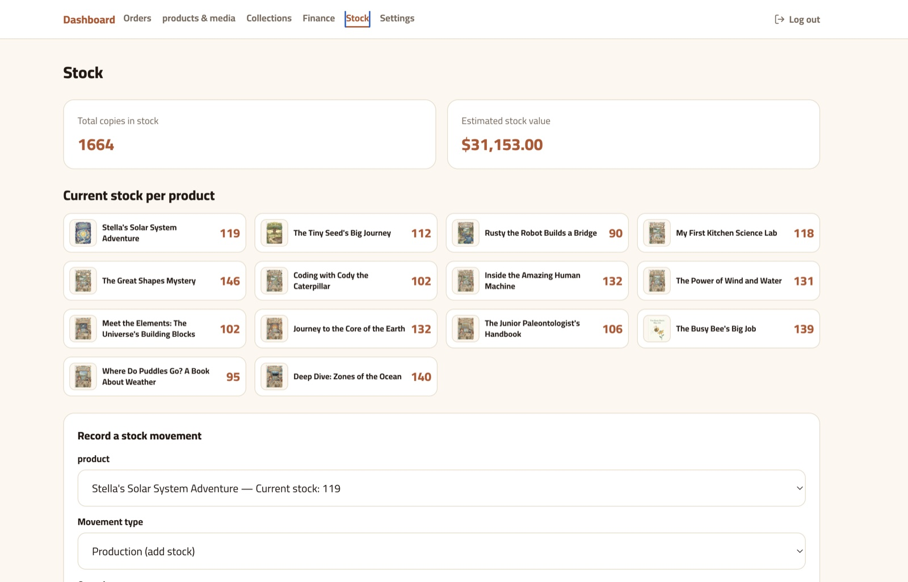
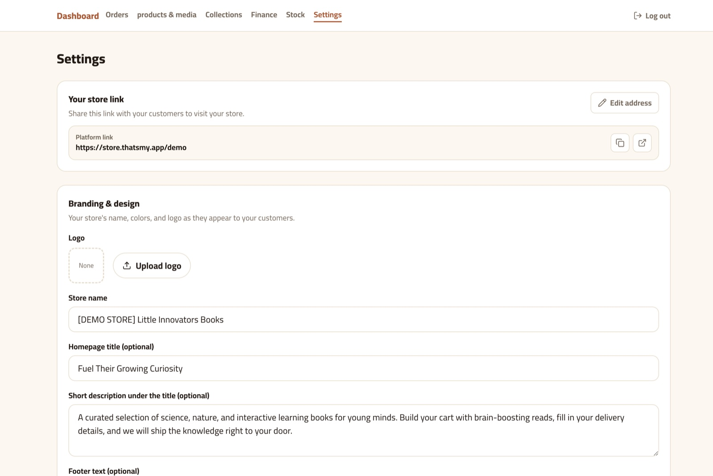

# Multi-tenant Storefront

A self-hostable, **multi-tenant** e-commerce platform: run many independent
online stores from one deployment, each with its own storefront, admin
dashboard, branding, and catalog. Built bilingual (**Arabic / English**) with
full **RTL ↔ LTR** support, so any store can switch its entire UI language from
a setting.

Originally built for a small direct-to-customer shop (order by phone, no online
payment), it's a practical starting point for anyone who wants a lightweight
store + back office they fully control.

## Features

- **Multi-tenant** — each store lives at `yourdomain.com/<store-slug>` (or its
  own custom domain), fully isolated.
- **Per-store branding** — logo, name, hero copy, footer, and brand / background
  / text colors, all editable in Settings; a store's theme applies live to its
  storefront. New stores get a neutral default palette.
- **Bilingual UI (ar/en)** — one setting flips the whole dashboard *and*
  storefront between Arabic (RTL) and English (LTR). User-entered content is
  never machine-translated.
- **Catalog** — products with images + extra media, and **collections/bundles**
  (a fixed set, or "pick-your-own N" that the customer assembles).
- **Orders** — status pipeline (new → confirmed → in progress → shipped →
  delivered), payment tracking, a per-order production/print list.
- **Finance & stock** — revenue/expense log with categories, forecasted
  revenue, and stock movements per item.
- **Configurable currency** and email notifications (via Resend) for new orders.

## Screenshots

_From the preseeded demo tenant (`npm run seed:demo`)._

### Storefront (customer-facing)

**Home** — themed hero, special-price collections, and the product grid.



**Product catalog** — every product with its cover, price, and one-tap add to cart.



**Cart & checkout** — delivery details only; no online payment — the shop follows up to arrange delivery and payment.



### Admin dashboard

**Orders & print list** — status/payment filters plus a per-product "copies to print" list for confirmed orders.



**Product editor** — edit title, description, price, and cover, with per-product order history.



**Finance** — revenue / expense / net totals, forecasted revenue from open orders, and a transaction log.



**Stock** — copies on hand and estimated value per product, plus stock-movement recording.



**Settings** — store link and per-store branding (name, hero copy, colors, logo).



## Tech stack

- [Next.js](https://nextjs.org) 16 (App Router, React Server Components) · React 19
- [Prisma](https://www.prisma.io) 6 + PostgreSQL
- [Tailwind CSS](https://tailwindcss.com) v4 (logical properties for RTL/LTR)
- [better-auth](https://www.better-auth.com) (email + one-time-code auth)
- [Vercel Blob](https://vercel.com/docs/storage/vercel-blob) for image/media uploads
- [Resend](https://resend.com) for transactional email
- [Vitest](https://vitest.dev) for tests · a tiny dependency-free i18n layer in `src/i18n`

## Getting started

Prerequisites: **Node.js 20+**, a **PostgreSQL** database, and (optional) Vercel
Blob + Resend accounts.

```bash
# 1. Install
npm install

# 2. Configure environment
cp .env.example .env.local
#    then fill in the values (see comments in .env.example)

# 3. Create the database schema
npm run db:migrate

# 4. Create your first admin user and seed the first store
npm run create-user -- you@example.com "a-strong-password" "Your Name"
npm run adopt-store -- you@example.com

# 5. Run it
npm run dev            # http://localhost:3000  (admin at /admin)
```

The seed store's defaults (slug, name, currency, item noun, custom domain) live
in `scripts/adopt-store.ts` and are all overridable — edit them, or pass options
to `buildStoreData`, to shape your first store.

### Useful scripts

| Command | What it does |
|---|---|
| `npm run dev` | Start the dev server |
| `npm run build` | `prisma generate` + production build |
| `npm run test` | Run the test suite (Vitest) |
| `npm run db:migrate` | Apply Prisma migrations (`prisma migrate deploy`) |
| `npm run create-user -- <email> <password> "<name>"` | Create an admin account |
| `npm run adopt-store -- <owner-email>` | Seed / adopt the first store |
| `npm run seed:demo` | Seed the isolated demo tenant (see below) |

## Demo environment

Spin up an isolated demo tenant preseeded with a full book catalog plus realistic
orders, customers, finance, and stock — enough to explore every admin screen:

```bash
npm run seed:demo
```

Like the other scripts, this reads the database connection from the environment.
Run it locally against `.env.local` with:

```bash
npx tsx --env-file=.env.local prisma/seed-demo.ts
```

It creates (and is safe to re-run to reset):

- a demo store — **Demo Bookshop**, storefront at `/demo`
- a demo admin login — **`demo@demo.store` / `demodemo1`** (sign in at `/admin/login`)
- 14 books, 5 collections, ~40 orders across all statuses, plus matching
  transactions and stock movements, so the finance and stock screens are populated

**Access it:** browse the storefront at `<your-host>/demo`, or sign in to the
dashboard at `<your-host>/admin/login` with the demo credentials to see the orders,
finance P&L, and stock levels.

The seed only ever touches the demo store — your other tenants are untouched. All
generated content is deterministic (fixed PRNG seed); only the order/transaction
dates shift to stay relative to "today," so re-running reproduces the same demo.

## Deployment

Designed to deploy on **Vercel** with a managed PostgreSQL (Supabase or Neon)
and a Vercel Blob store. Set the same variables from `.env.example` in your
project settings, run `npm run db:migrate` against the production database, then
deploy. See [`docs/DEPLOY.md`](docs/DEPLOY.md) for a detailed walkthrough,
including migration-rehearsal notes.

## Project layout

```
src/
  app/                 # Next.js routes: /admin (dashboard) and /[storeSlug] (storefront)
  actions/             # server actions (orders, products, collections, finance, ...)
  components/          # admin/ and storefront/ UI
  i18n/                # dictionaries (ar/en) + t() helper + LocaleProvider
  lib/                 # data access, store context, validation, helpers
prisma/                # schema + migrations
scripts/               # create-user, adopt-store, one-off maintenance scripts
docs/                  # deploy guide + design specs
```

## Notes

- This is a real project extracted for public reuse; the design/spec documents
  under `docs/` reflect how features were built and may reference the original
  shop's context.
- No online payment is built in — the original flow contacts customers to
  arrange delivery and payment. Add a payment provider if you need one.

## License

[MIT](LICENSE) — free to use, modify, and distribute, including commercially.
